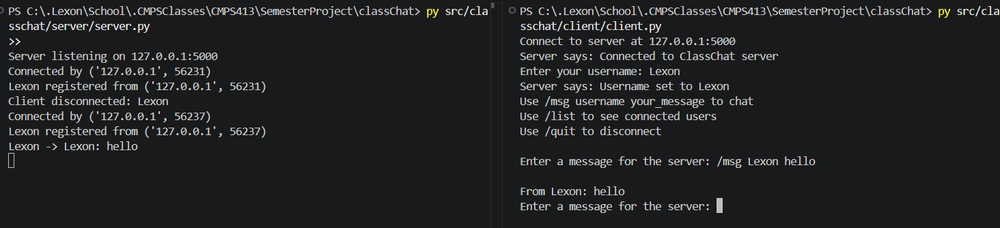
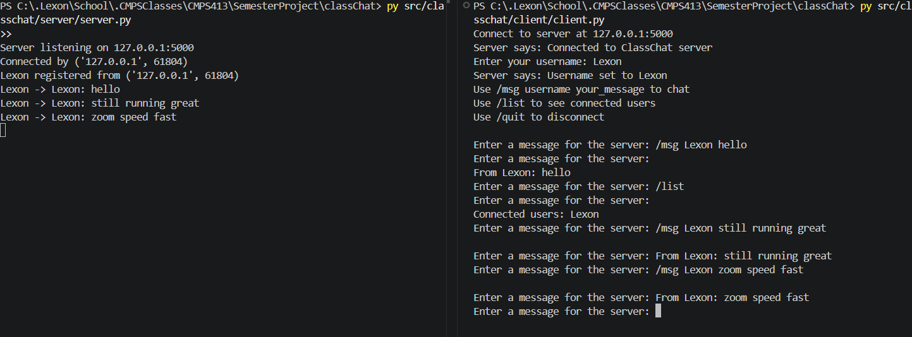
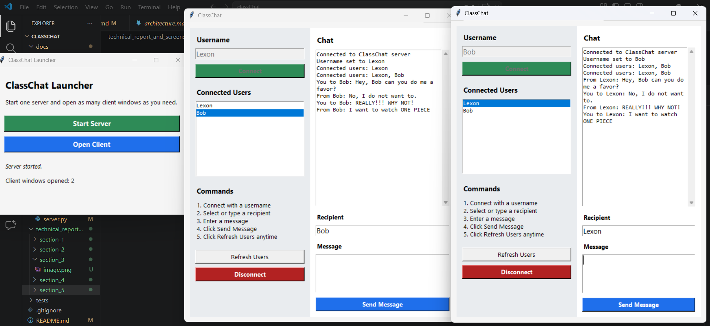

# Technical Report

## Project Title

ClassChat: A Python TCP/IP Class Communication System

## Overview

This project implements an online chat system named `ClassChat` for communication between students and an instructor. The system uses a central TCP server to manage connections, track connected users, and forward messages between clients. The project was implemented in Python using sockets, threads, JSON messaging, and a Tkinter-based graphical user interface.

## Objectives

The main goals of the project were:

- build a TCP client and server
- keep client-server communication persistent
- support multiple clients at the same time
- route messages from one client to another through the server
- handle practical issues such as duplicate usernames and disconnected users
- provide both command-line and GUI interaction

## Technologies Used

- Python 3
- `socket`
- `threading`
- `json`
- `tkinter`

## System Design

`ClassChat` follows a central server model.

- The server listens on a fixed IP address and port.
- Each client connects to the server over TCP.
- The client registers a username after connecting.
- The server stores connected usernames and sockets in a shared dictionary.
- The server routes direct messages to the intended recipient.

The system uses JSON messages to structure communication between the client and the server.

## Section 1: Client-Server Communication Using TCP/IP

For the first section, a basic TCP server and client were implemented.

### Server

The server was implemented to:

- create a socket
- bind to a local IP address and port
- listen for incoming client connections
- accept a client connection
- send an acknowledgment
- receive data from the client
- send a response back

### Client

The client was implemented to:

- create a socket
- connect to the server
- wait for acknowledgment
- send a message
- receive a response

This established the base communication required for the rest of the project.

### Screenshot



## Section 2: Advanced Client

The client was then improved so it could continue running during a session instead of closing after one message.

- The console client uses a receive thread so it can receive server responses while the user continues interacting.
- The client remains active until the user chooses to disconnect.
- This design prepares the client for real-time chat behavior.

Although the instructions mention `select()`, the final implementation used `threading`, which is simpler and practical for the Windows environment used in this project.

### Screenshot



## Section 3: Multi-Thread Communication Server

The server was upgraded to handle multiple clients at the same time by using `threading`.

- The main server thread continuously accepts new connections.
- Each connected client is handled in a separate thread.
- A shared dictionary stores connected usernames and sockets.
- A lock protects shared client data from concurrent access issues.

This allows multiple users to stay connected and communicate during the same session.

### Screenshot



## Section 4: Client-Client Communication

The final core section implemented direct client-to-client communication through the server.

### Implemented Features

- username registration
- connected client tracking
- direct message forwarding
- connected-user listing
- client disconnect handling
- error handling for invalid usernames and missing users

### JSON Protocol

The system uses JSON messages with fields such as:

- `type`
- `sender`
- `receiver`
- `text`

Example:

```json
{
  "type": "chat",
  "sender": "Alice",
  "receiver": "Bob",
  "text": "Hi, do you know how TCP works?"
}
```

### Message Flow

1. A client connects to the server.
2. The client registers a username.
3. The server stores the username and socket.
4. A client sends a direct message request.
5. The server finds the receiver and forwards the message.
6. The receiver sees the message in their client window.

### Screenshot


## Graphical User Interface

A Tkinter GUI client was added after the networking features were completed.

The GUI includes:

- username entry
- connect button
- connected users list
- command/help area
- chat display box
- recipient field
- message field
- send button
- disconnect button

A separate launcher GUI was also added to:

- start the server
- open one or more GUI client windows

The GUI uses the same JSON protocol and server implementation as the console client.

### Screenshot


## Error Handling and Robustness

The project includes handling for:

- blank usernames
- duplicate usernames
- invalid commands
- missing recipients
- abrupt client disconnections
- recipient disconnecting before delivery
- malformed JSON or unreadable socket data

These checks make the system more robust and match the project requirement for client management.

## Conclusion

This project successfully implemented the core requirements of `ClassChat` using Python sockets and threads. The final system supports multiple concurrent clients, direct messaging through a central server, JSON-based communication, and both console and GUI interfaces.
